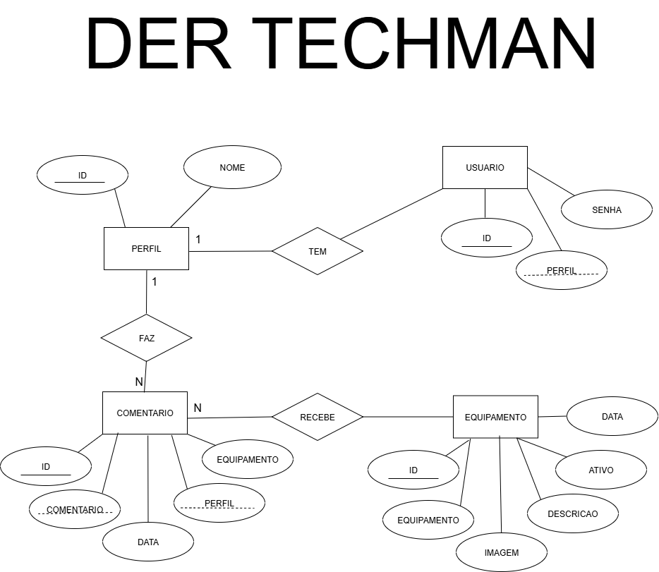

# Usuários para Login

 senha   | perfil        |
---------|---------------|
 111111  | Administrador |
 414141  | Gerente       |
 313131  | Comum         |
 654321  | Administrador |
 123456  | Tecnico       |

> As senhas para login são exatamente como mostrado na tabela acima.

# Techman - Sistema de Gerenciamento de Equipamentos


## Descrição
O Techman é um sistema Full Stack para gerenciamento de equipamentos, com controle de usuários, permissões por perfil, cadastro, exclusão e comentários em equipamentos. O sistema foi desenvolvido utilizando Node.js, Express, Prisma ORM, MySQL e uma interface web moderna.

## Funcionalidades
- Login com controle de sessão
- Perfis: Administrador, Técnico, Gerente, Comum
- Cadastro, listagem e exclusão de equipamentos (restrito por perfil)
- Comentários em equipamentos
- Upload e seleção de imagens para equipamentos
- Exclusão em cascata de comentários ao remover equipamentos

## Capturas de Tela
### Tela de Login
  

### Tela Principal (Gerente, Tecnico, e Administrador )
 

### Tela Principal (Comum)
 

### Comentarios
 

## Estrutura do Projeto
```
api/           - Backend Node.js/Express/Prisma
web/           - Frontend HTML/CSS/JS
```

## Como rodar o projeto
1. Instale as dependências em `api/`:
   ```bash
   cd api
   npm install
   ```
2. Configure o banco de dados em `.env` (MySQL).
3. Rode as migrações Prisma:
   ```bash
   npx prisma migrate dev
   ```
4. Inicie o backend:
   ```bash
   node server.js
   ```
5. Abra o `web/index.html` em seu navegador.

## Diagramas
### Diagrama de Atividade


### Diagrama Entidade-Relacionamento


## Créditos
Desenvolvido por Joaoangra.

---
