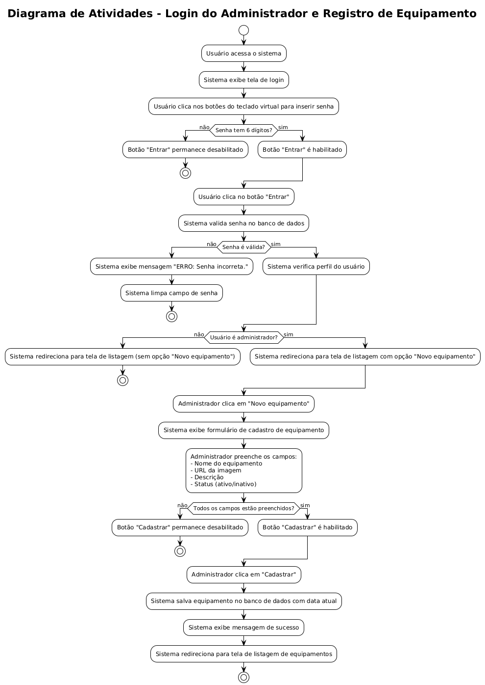
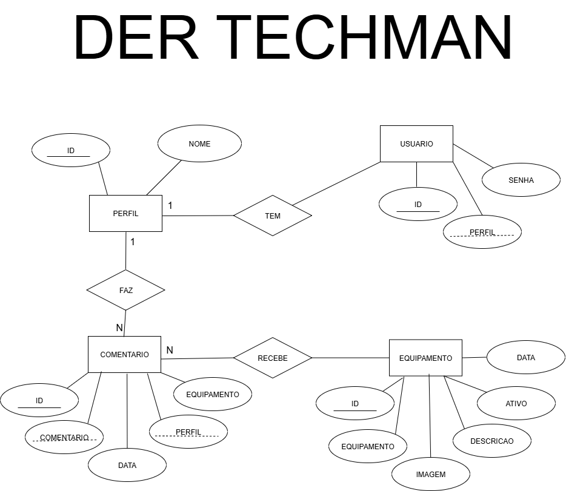

# Documentação - Techman

Esta pasta contém a documentação visual do projeto Techman.

## Diagramas

### Diagrama de Atividade
O diagrama de atividade ilustra o fluxo de processos do sistema, incluindo login, gerenciamento de equipamentos e interações dos usuários.

### Diagrama Entidade-Relacionamento (DER)
O DER representa a estrutura do banco de dados, mostrando as entidades (usuários, equipamentos, comentários) e seus relacionamentos.

Esses diagramas foram utilizados para o planejamento e desenvolvimento do sistema, garantindo uma arquitetura clara e eficiente
